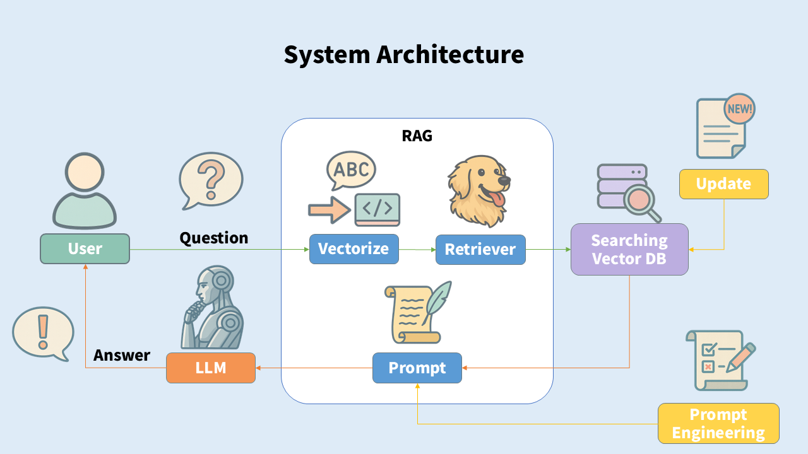

skn12기 3차 프로젝트 1팀

# 🐾 우리 개 어디가? - 반려동물 동반 여행 가이드 챗봇

> **조 이름:** 집사들  
> **주제:** 반려동물 동반 여행 가이드 챗봇  
> **앱 이름:** _우리 개 어디가?_

---

## ✨ 주제 선정 이유

 
반려동물을 키우는 사람들이라면 다 한번쯤 겪는 경험.  
**우리 애랑 같이 여행가고 싶다.**  
**이 좋은걸 함께 나누고 싶다.**

**그러나..**  
 
현실은 그렇게까지 녹록치 않습니다.  
반려동물을 거절하는 가게에서부터 숙박시설, 이동방법까지..  
찾아보고 알아봐야 하는 것이 한두개가 아니죠.

 
**어떻게 하면 반려동물과 편하게 여행을 즐길 수 있을까?**  
우리 프로젝트의 시작은 이런 간단한 질문에서부터 시작했습니다.

 
반려동물과 함께 여행할 수 있는 가장 간단한 방법을 알려주는 챗봇.  
다양한 반려동물 동반 가능 시설 및 관광지, 문화유적지와 숙박시설에 대한 정보.  
편안하게, 그리고 '적법하게' 함께 이동할 수 있는 방법까지-

우리 앱은 **반려동물과 함께하는 모든 사람들이 편안한 여행을 즐기는 것**을 목표로 하고 있습니다.

---

## 👨‍👩‍👧‍👦 조원 명단

| 김승학                  | 박슬기                  | 이용규               | 이주영                  | 조성지                   |
| ----------------------- | ----------------------- | -------------------- | ----------------------- | ------------------------ |
|     |     |  |     |      |
| LLM 모델 연결, 파인튜닝 | 데이터 수집 및 API 연결 | 프롬프트 엔지니어링  | 스트림릿 구현 및 문서화 | 프롬프트 엔지니어링, ppt |

---

## 🧠 시스템 아키텍처

> 

---

## ⚙️ 사용 기술 스택

- 
- 
- 
- 
- 
- 기타: Pandas, NumPy, FAISS, Data.go.kr API 등

---

## 🔁 시스템 흐름도

1. CSV 파일 → JSON 변환

- 사용자 데이터 및 장소 정보를 구조화된 형태로 가공합니다. 2.임베딩 처리
- JSON 데이터를 문장 벡터로 변환하여 검색 가능하도록 처리합니다.

3. 벡터스토어(DB) 저장

- 임베딩된 데이터를 FAISS 등 벡터 DB에 저장하여 빠른 검색이 가능하도록 구성합니다.

4. 유저 인풋 수집

- 사용자가 여행에 필요한 정보를 자연어로 입력합니다.

5. LLM을 통한 인텐트 분석

- 입력 문장에서 지역, 반려동물 종류, 여행일자, 요청 카테고리 등을 추출합니다.

6. 리트리버 → 벡터스토어 검색

- 분석된 인텐트를 기반으로 적합한 장소나 정보를 벡터스토어에서 검색합니다.
- 날씨 API를 호출하여 여행 예정일의 날씨 정보를 받아옵니다.

7. (검색 결과 부족 시)

- 공공데이터포털 API 호출 (예: 숙박업소, 식당 정보 등)

8. 프롬프트 구성

- 검색된 데이터와 유저 조건을 조합하여 LLM에 전달할 프롬프트를 생성합니다.

9. LLM 응답 생성

- 여행 정보, 주의사항, 이동 팁 등을 포함한 자연어 응답을 생성합니다.

10. 최종 출력

- Streamlit 앱을 통해 사용자에게 답변을 제공합니다.

---

## 사용된 API KEY 이름

1. OPENAI_API_KEY : https://openai.com/api/
2. OPEN_DATA (기상청\_단기예보 조회 서비스) : https://www.data.go.kr/tcs/dss/selectApiDataDetailView.do?publicDataPk=15084084
3. TOUR_API_KEY (한국관광공사*반려동물*동반여행\_서비스) : https://www.data.go.kr/tcs/dss/selectApiDataDetailView.do?publicDataPk=15135102
4. NAVER_CLIENT_KEY, NAVER_CLIENT_SECRET_KEY(네이버 API)

---

## 📈 향후 업데이트 방향

- 🔄 **결과 Re-Ranking**  
  단순 상위 노출이 아닌, 유저의 **요청 목적에 맞는 결과 우선 정렬** 기능 도입 예정

- 🧩 **데이터셋 보강 및 자동 반영**  
  새로운 장소나 숙박 정보가 추가될 경우, **벡터스토어 DB 업데이트 + 추가 API 연동**도 확장할 예정

- ⚡ **캐시 기능 도입**  
  동일한 질의에 대해 반복적으로 LLM 및 API를 호출하지 않도록, **쿼리-응답 쌍을 캐싱**하여 응답 속도를 높이고 비용을 절감할 계획

---

## 💬 팀원 한 줄 회고

| 이름   | 한 줄 회고                                                                                                                                    |
| ------ | --------------------------------------------------------------------------------------------------------------------------------------------- |
| 김승학 | 팀원의 꾸준한 조언으로 수업 시간에 배운 LLM 분야와 RAG에 대한 응용할 수 있는 값진 경험이 된것 같습니다.                                       |
| 박슬기 | 처음엔 막막했지만 방향성을 잡고 팀원들과 함께 하나하나 이뤄내가는 과정이 즐거웠습니다.  4차 프로젝트때도 잘 부탁드립니다!                  |
| 이용규 | llm과 프롬프트에대한 이해가 부족했었는데 실습을 통해 어느정도 학습의 효과를 본것같다.  그리고 같이 한 수고하신 조원들에게도 감사하다.      |
| 이주영 | 팀원들과의 협업을 통해 자연어 처리에 대해 깊이 배우고,  실질적인 결과물을 만들며 보람을 느낄 수 있었던 뜻깊은 프로젝트였습니다!!           |
| 조성지 | 너무 좋은 팀원분들을 만나서 순탄하게 진행된 것 같습니다.  수업시간에 배웠던 LLM모델이나 RAG를 복습하면서 직접 적용해볼 수 있어 좋았습니다! |

---
